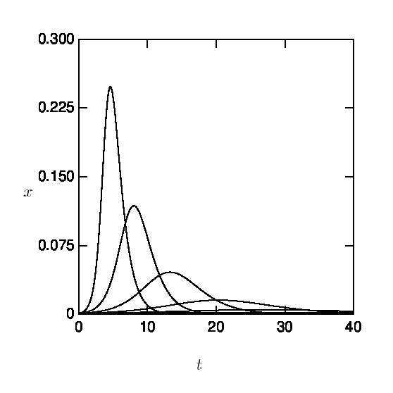
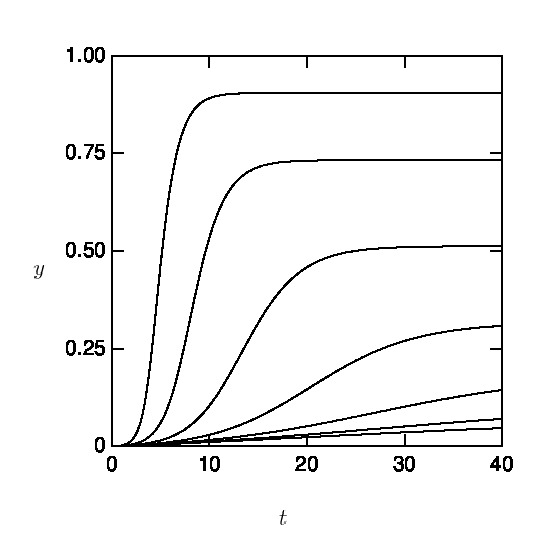

# coronavirus
Simple integrator to generate plot for the  SIR model

Used to create figures in [(Simplified) Mathematics of Coronavirus (SARS-CoV-2) ](http://jun-makino.sakura.ne.jp/talks/kobe20200326.pdf)

## Installation and Usage

git clone and run `shards install`. Then crystal coronaplot.cr -- -h
to see optons

## Examples

